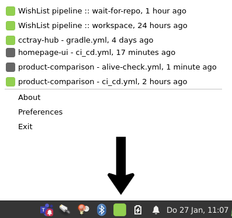
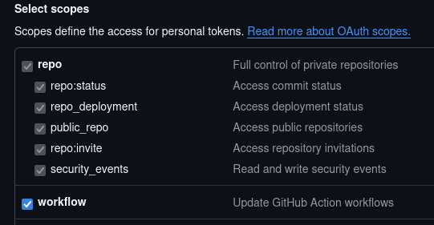

# cctray hub

This service translates the github workflow API to the CCTray (cc.xml) format to allow seeing your build chain status on your desktop
in tools like [BuildNotify](https://anaynayak.github.io/buildnotify/) or [ccmenu](https://ccmenu.org/)



## where to find it

We provide docker images over here: https://hub.docker.com/r/hennr/cctray-hub/tags

## how to use

cctray-hub provides dynamic URLs based on three strings that you need to provide:

* repo owner
* repo name
* workflow name or id

```http://localhost:8080/cctray/<organisation-or-owner>/<repo>/<workfow-name-or-id>```

for cctray itself this will be:

```http://localhost:8080/cctray/idealo/cctray-hub/gradle.yml```


Note that cctray-hub will query builds from the main branch per default. 
If you need other (or even all) branches to get queried as well, feel free to open an issue.

### accessing private repositories

If you want cctray-hub to read private github repos / actions, you need to provide a PAT that grants access to these repos.
A classic token with the `workflow` scope should be sufficient. The `repo` scope will be enabled automatically by github.
Don't forget to authorize the token for the repos you want to access.



Provide that token as an env variable like this then, when starting cctray-hub:

`GITHUB_API_TOKEN=YOUR_PAT`

### protecting the endpoints with basic auth

Basic auth can be autoconfigured by setting the following application properties:

`cctray-hub.username=YOUR_USERNAME`

`cctray-hub.password=YOUR_PASSWORD`

### access logs in JSON format

Access logs via logback and JSON log format can be enabled by setting the following profile:

`SPRING_PROFILES_ACTIVE=json-log-format`

## references

CCTray spec
* https://cctray.org/v1/

github docs regarding workflows
* https://docs.github.com/en/rest/reference/actions#get-a-workflow

## credits

cctray-hub is heavily inspired by this project: https://github.com/joejag/github-cctray

